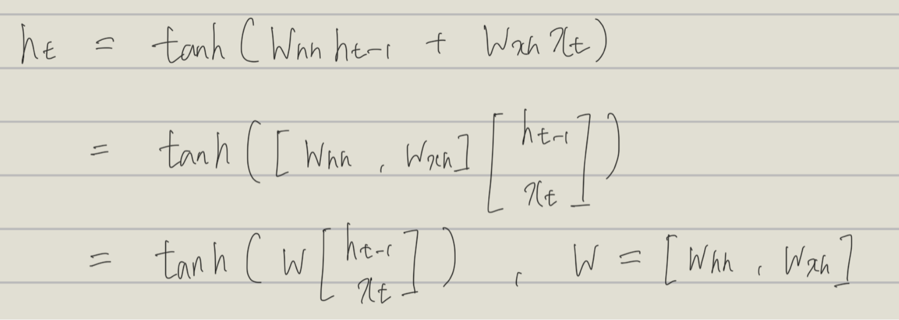

함수 f가 다음과 같이 정의되는 경우 이를 Vanilla RNN(기본 순환 신경망 모델)이라고 한다.

위와 같은 꼴로 표현되는 RNN을 Vanilla RNN이라고 한다.

가중치 공유 효과
- RNN은 가중치를 모든 단계에서 공유하기 때문에 특정 구조가 어느 위치에서 나타나더라도 포착할 수 있다.
- 모든 단계가 같은 파라미터를 사용하므로 단계를 쉽게 추가, 삭제할 수 있어 가변 길이 데이터를 유연하게 처리할 수 있다.
