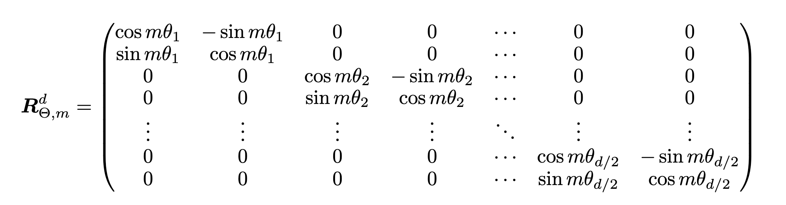
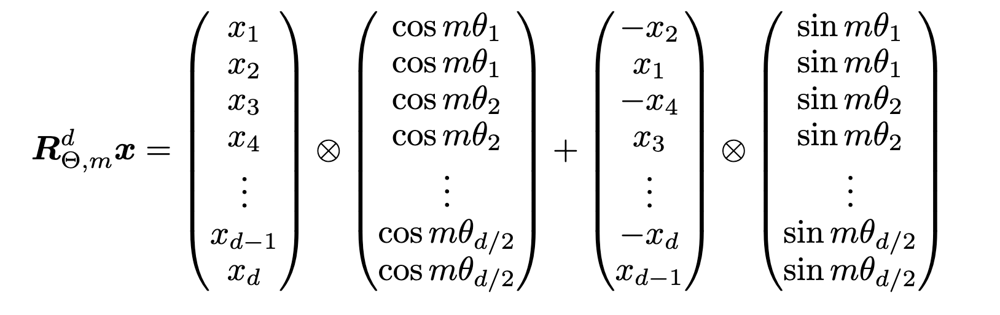

# ROFORMER: ENHANCED TRANSFORMER WITH ROTARY  POSITION EMBEDDING
https://arxiv.org/abs/2104.09864

## 배경

1. Absolute position embedding의 문제점
- 이 토큰이 몇 번째 위치에 있는가는 모델에 알려줄 수 있지만 두 토큰 사이의 거리가 얼마인지에 대해서는 직접적으로 알려줄 수 없다.
- Trainable한 absolute position embedding의 경우에는 길이 확장에 취약하다. 학습 상황에서 1024 토큰 길이까지만 훈련됐다면 이 모델은 1025 이상의 sequence에서 일반화되기 어렵다.
2. Relative position embedding의 문제점
- additive position encoding 방식에 묶여있어 linear attention의 효율적인 연산과 잘 맞지 않는다.

## 제안

1. Absolute position 대신 relative position만을 입력하자.

$$
<f_q(x_m, m), f_k(x_n, n)> = g(x_m, x_n, m-n)
$$
$x_m$: m번째 위치 입력
$f_q$: $x_m$을 입력받아서 $W_q$에 통과시킨 뒤 Q 벡터를 만드는 함수

즉, m번째 위치 토큰의 Q와 n번째 토큰의 K 각각에 대해서 absolute position이 들어가는 게 중요한 게 아니라 $Q^T K$ 연산 결과에 상대적 위치 거리 $m-n$이 남는 게 중요하다.

2. Additive 방식 대신 벡터를 회전시키자.

$$
\begin{aligned}
f_q(x_m, m) &= (W_q x_m)e^{im\theta} \\
f_k(x_n, n) &= (W_k x_n)e^{in\theta} \\
g(x_m, x_n, m-n) &= Re[(W_q x_m)(W_k x_n)^*e^{i(m-n)\theta}]
\end{aligned}
$$
$Re[complex \, number]$: 복소수를 입력으로 받으면 실수부만 리턴

d=2라고 가정하고 위 식을 더 구체적으로 전개해보자.
d=2이기 때문에 $W_q x_m$은 2차원 쿼리 벡터이다.

$$
W_q x_m =
\begin{pmatrix}
a \\
b
\end{pmatrix}
$$
라고 하면 이를 복소수로는
$$
a + ib
$$
처럼 볼 수 있다. 이는 2차원 실수 공간 $\mathbb R^2$과 복소수 공간 $\mathbb C$가 일대일 대응인 것을 활용한 표현법 중 하나이다.
즉, 
$$
(a,b) \in \mathbb{R}^2
\quad \Longleftrightarrow \quad
a + ib \in \mathbb{C}
$$
이다.

$e^{im\theta}$는 sin, cos 행렬곱으로 치환될 수 있다. 여기에서 오일러 공식이 활용된다.
$$
e^{i\alpha} = \cos \alpha + i \sin \alpha
$$
여기에서 $\alpha$를 $m\theta$로 바꿔 표현하면 
$$
e^{im\theta} = \cos(m\theta) + i\sin(m\theta)
$$
이다. 따라서 위의 $f_{\{q, k\}}(x_m, m) = (W_q x_m)e^{im\theta}$는 사실상
$$
(a + ib)(\cos(m\theta) + i\sin(m\theta))
$$
가 된다. 이 식을 전개해보면
$$
= a\cos(m\theta) - b\sin(m\theta)
+ i(a\sin(m\theta) + b\cos(m\theta))
$$
이다. 위 식의 실수부와 허수부를 분리해보자.
$$
\begin{aligned}
\text{real part} &= a\cos(m\theta) - b\sin(m\theta) \\
\text{imaginary part} &= a\sin(m\theta) + b\cos(m\theta)
\end{aligned}
$$
이를 2차원 벡터로 다시 쓰면
$$
\begin{pmatrix}
a\cos(m\theta) - b\sin(m\theta) \\
a\sin(m\theta) + b\cos(m\theta)
\end{pmatrix}
$$
이고 이를 행렬곱으로 분해하면
$$
\begin{pmatrix}
\cos(m\theta) & -\sin(m\theta) \\
\sin(m\theta) & \cos(m\theta)
\end{pmatrix}
\begin{pmatrix}
a \\
b
\end{pmatrix}
$$
과 완전히 같다. 따라서,
$$
(a + ib)e^{im\theta}
\quad \Longleftrightarrow \quad
\begin{pmatrix}
\cos(m\theta) & -\sin(m\theta) \\
\sin(m\theta) & \cos(m\theta)
\end{pmatrix}
\begin{pmatrix}
a \\
b
\end{pmatrix}
$$
이때 주의해야 할 점은 Re 함수가 적용되는 건 attention score이고 $f_q$, $f_k$는 허수부를 버리지 않는다는 점이다.

이제 이 값을 가지고 내적을 진행하면 어떻게 되는지 확인해보자.
회전이 이미 적용된 query와 key를 다음과 같은 복소수로 표현할 수 있다.
$$
\begin{aligned}
q_m &= u + iv \\
k_n &= s + it
\end{aligned}
$$
이 둘을 2차원 벡터로 보면
$$
q_m =
\begin{pmatrix}
u \\
v
\end{pmatrix},
\qquad
k_n =
\begin{pmatrix}
s \\
t
\end{pmatrix}
$$
이고 내적하면 
$$
q_m^\top k_n = us + vt
$$
이다. 벡터 대신 앞서 논의한 대로 복소수로 연산하면 다음과 같다. 그 이유는 [Dot Product Using Complex Number](../../../math/dot-product-using-complex-number.md) 참고.
$$
\operatorname{Re}\left[(u+iv)(s+it)^*\right]
$$
위 식을 더 구체적으로 풀어보면 
$$
\begin{aligned}
q_m &= (W_qx_m)e^{im\theta} \\
k_n &= (W_kx_n)e^{in\theta}
\end{aligned}
$$
이고 여기에 켤레 복소수를 적용하여 실수부만 추출하면
$$
\operatorname{Re}\left[q_m k_n^*\right]
$$
이다. $k_n$을 계산하면
$$
k_n^*
=
\left((W_kx_n)e^{in\theta}\right)^*
=  
(W_kx_n)^* e^{-in\theta}
$$
이다. 따라서
$$
q_m k_n^*
=
(W_qx_m)e^{im\theta}
(W_kx_n)^* e^{-in\theta}
= 
(W_qx_m)(W_kx_n)^*e^{i(m-n)\theta}
$$
이다. 수식 안에 상대 위치 $(m-n)$만 깔끔하게 남는 것을 확인할 수 있다.

정리하면, Query, Key 토큰을 각각 복소수로 해석하여 내적을 진행하면 토큰의 절대적 위치가 아닌 상대적 거리만 반영된 attention score를 얻을 수 있다. attention score가 $x_m$, $x_n$, $m-n$에만 의존한다. $m, \, n$에 의존하지 않는다.

## 구현

위는 수학적 증명이고 실제 코드 구현은 다르다. 이는 회전 행렬이 sparse한 성질을 갖고 있기 때문이다.

따라서 위 행렬에 대해 행렬곱을 진행하는 것은 매우 비효율적이다. 대신 element wise 연산으로 구현할 수 있다.

$$
\begin{aligned}
x_{2i-1}' &= x_{2i-1}\cos(m\theta_i) - x_{2i}\sin(m\theta_i) \\
x_{2i}' &= x_{2i-1}\sin(m\theta_i) + x_{2i}\cos(m\theta_i)
\end{aligned}
$$
