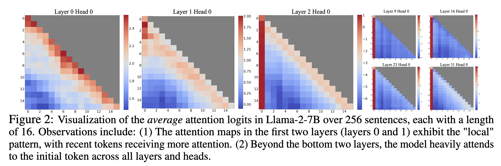
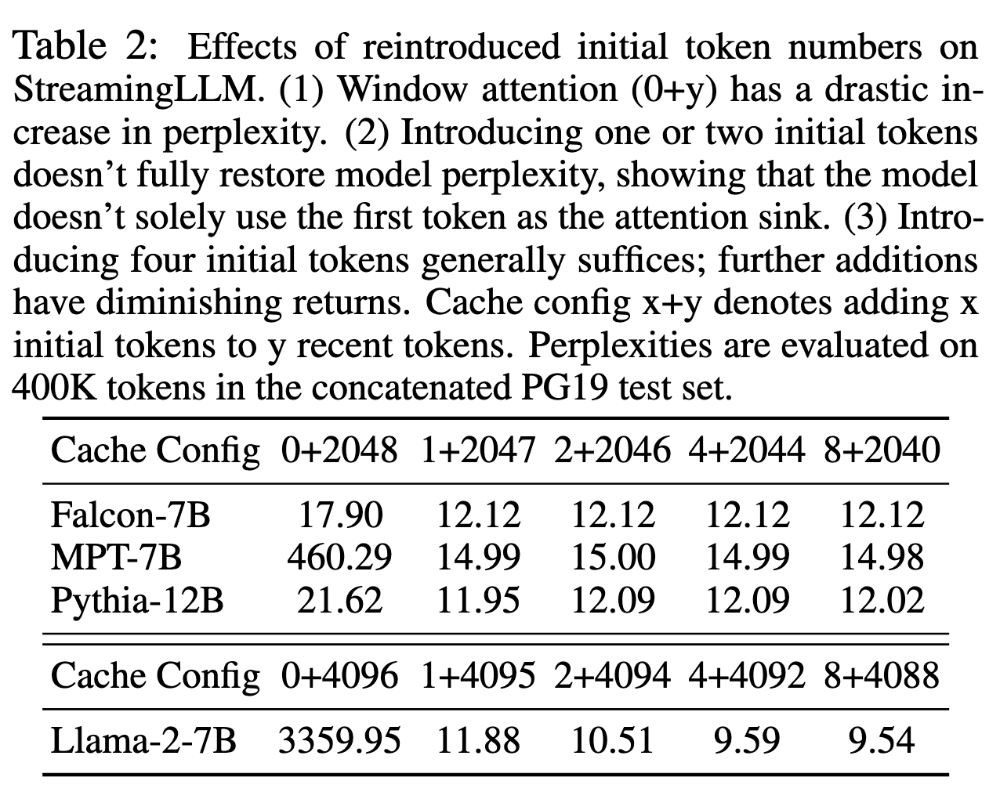

# Efficient Streaming Language Models with Attention Sinks
https://arxiv.org/abs/2309.17453

# 배경

스트리밍 상황에서 대화가 길어지면 KV cache 메모리가 폭증하는 문제가 발생한다.

Sliding Window Attention은 자연스러운 해결책처럼 보이지만 본 연구는 대화 길이가 캐시 사이즈를 넘어가는 순간 성능이 급격히 하락한다고 보고한다.

이때 저자들이 관찰한 현상이 바로 Attention Sink이다. 직관적으로는 attention score가 후반부 토큰에 높게 나타나야 할 것 같지만(다음 토큰 예측에 있어서 10만 토큰 이전의 단어보다는 같은 문장 안의 가까운 단어가 영향력이 클 것 같다는 직관.) 모델이 의미적으로 중요하지 않아도 초반 몇 개 토큰에 비정상적일 정도로 큰 attention score를 몰아주는 경향이 나타난다.

위 그림을 보면 초반 레이어에서는 인간의 직관과 비슷하게 attention map이 나타나지만 레이어가 깊어질수록 극초반 토큰에 대부분의 attention score가 할당되는 것을 볼 수 있다.

이는 softmax 연산의 특성 때문이라고 저자들은 말한다. Softmax 연산 특성상 attention weight들의 합이 반드시 1이 되어야 하는데 만약 높은 attention score가 나타나지 않는 경우 어쩔 수 없이 합 1을 맞추기 위해 초반 소수의 토큰에 sink에 버리듯 할당한다는 것이다.

이러한 현상 때문에 대화 길이가 캐시 사이즈를 넘어가는 순간(큰 attention score를 받는 초반의 소수 토큰이 kv cache에서 탈락되는 순간) 모델의 성능이 급격히 붕괴하는 것이라고 저자들은 설명한다.

그래서 저자들이 제안하는 것이 최근의 토큰들로 이루어진(기존과 똑같이 동작하는) rolling KV cache는 유지하되 맨 앞의 소수(저자들은 4개를 권장한다) 토큰을 영구 보관하여 sink(배수구) 역할을 하도록 만드는 것이다. 이 방식을 통해 한정된 길이로 학습된 LLM을 파인튜닝 없이 그 이상의 긴 컨텍스트에서도 안정적으로 기능하도록 만들 수 있다고 말한다.

# 제안

저자들은 attention sink 토큰 몇 개 + 최근 토큰들의 rolling KV cache로 구성된 StreamingLLM을 제안한다.

본 연구는 perplexity를 성능 지표로 주로 사용하는데 초기 4 토큰을 유지하는 것과 아닌 것에서 아래 그림과 같은 차이가 발생한다고 말한다.

파인튜닝 없이도 sink token을 버리지 않는 것으로 모델들이 낮은 perplexity를 유지하는 것을 볼 수 있다. 저자들은 여기서 더 나아가 학습 상황부터 이를 염두에 두고 sink token을 샘플에 붙일 것을 제안한다. 모든 학습 데이터의 샘플 앞에 trainable placeholder sink token을 붙여 학습하면 초기 여러 토큰이 아니라 해당 sink token 하나만으로 안정성을 얻을 수 있다는 것이다.

# 논문에서 인정한 한계

무한 추론을 가능하게 만드는 방법은 아니다. 여전히 KV cache 안에 남아있는 정보만 추론에 사용할 수 있기에 기억력이 중요한 초장기 대화, 매우 긴 문서 요약 같은 작업에는 적합하지 않다고 말한다.

# 개인적인 의문점

이 연구는 attention sink 현상을 밝혀내고 해결책을 내놓은 데에서 의의가 있다. 하지만 초반 몇 개 토큰을 남겨놓는 아이디어는 근본적인 해결책은 아닌 것처럼 보인다. 당장은 이러한 응급처리로 모델 성능을 안정화할 수 있겠지만 attention sink 현상이 왜 발생하는 것인지, 애초에 발생하지 않도록 개선할 수는 없는지에 관한 추가 연구가 필요할 것으로 보인다.
