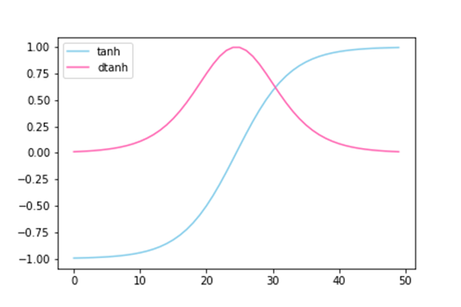
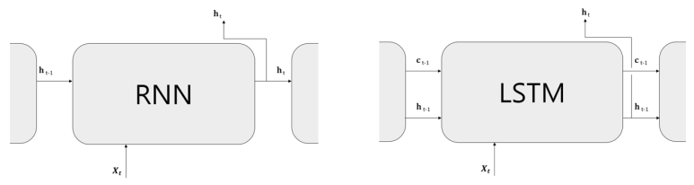
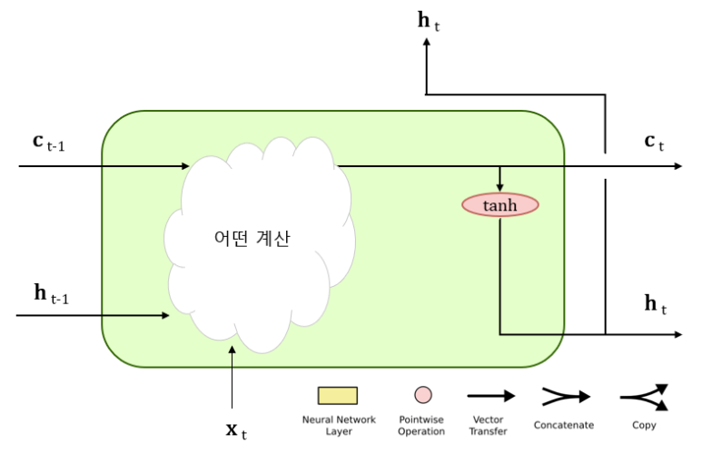
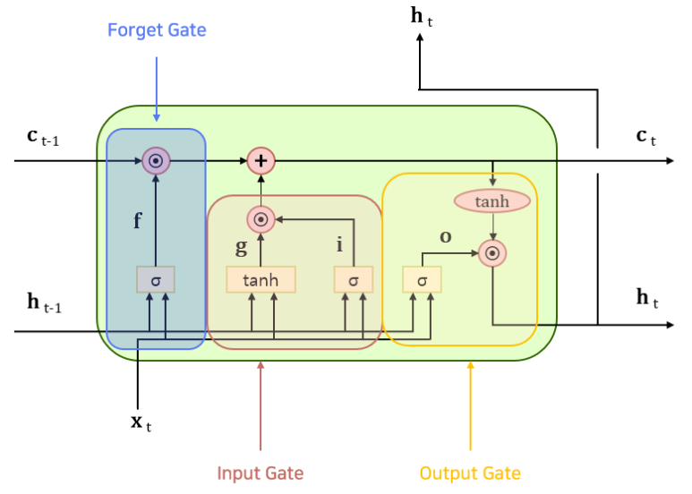

## 탄생 배경

RNN은 vanishing gradient 현상으로 인해 자연어 처리 시 긴 문맥을 기억하는 데 문제가 있다.

위와 같이 gradient saturation 현상을 보이는 tanh를 activation function으로 사용하는 전통적인 바닐라 RNN에게 있어 gradient vanishing problem은 필연적이다.

Vanilla RNN과 LSTM의 그림을 통한 단순한 비교. LSTM은 hidden state 외에도 c라고 하는 입출력이 하나 추가되었다. 이 c는 memory cell(또다른 표현으로는 cell state, 기억 셀)이라 불리며 LSTM만의 기억 메커니즘으로 동작한다. 특징으로는 cell state의 값은 LSTM 계층 내에서만 주고받는다는 것이다. hidden state는 출력층 W_hy의 입력으로 사용될 수도 있지만 cell state 값은 내부 상태로만 쓰이고 외부에 연결되지 않는다.

LSTM을 정말 간단화한 그림. 중요한 점은 c를 입력으로 하여 어떤 계산을 거치면 h가 된다는 것. LSTM에서 c는 장기 기억(long term), h는 단기 기억(short term)을 담당한다. 각각 장기, 단기로 나뉘는 이유는 후술.

이 그림을 바탕으로 LSTM을 정복해보자.

Forget gate
$W_f$ : 입력 $x_t$에 곱하는 가중치
$U_f$: hidden state $h_{t-1}$에 곱하는 가중치
$b_f$: bias

Input gate
$W_i$ : 입력 $x_t$에 곱하는 가중치
$U_i$: hidden state $h_{t-1}$에 곱하는 가중치
$b_i$: bias

Candidate memory(그림에서는 g로 표기)
$W_c$
$U_c$
$b_c$

Output gate
$W_o$
$U_o$
$b_o$

입출력 벡터의 크기가 아래와 같다고 하자.
$$
\begin{aligned}
x\in \mathbb{R}^{d_x}\\
h\in \mathbb{R}^{d_h}\\
c\in \mathbb{R}^{d_h}
\end{aligned}
$$

이 경우 가중치 행렬의 크기는 아래와 같다.

$$
\begin{aligned}
W &\in \mathbb{R}^{d_h\times d_x}\\
U &\in \mathbb{R}^{d_h\times d_h}\\
b &\in \mathbb{R}^{d_h}
\end{aligned}
$$

## 표준 LSTM의 forward 수식들

$f_t = \sigma(W_fx_t\,+\,U_fh_{t-1}\,+\,b_f)$
이전 레이어의 cell state 정보를 얼마나 유지할 것이냐? 에 관한 게이트 연산

$i_t = \sigma(W_ix_t\,+\,U_ih_{t-1}\,+\,b_i)$
이번 단계에서 들어오는 새로운 입력과 이전 단계의 hidden state 정보를 얼마나 유지할 것이냐?

$\tilde{c}_t = \tanh(W_cx_t\,+\,U_ch_{t-1}\,+\,b_c)$ 
이번 단계에서 들어오는 새로운 입력과 이전 단계의 hidden state 정보를 융합한 실제 내용, 정보

$c_t = f_t\odot c_{t-1} + i_t\odot \tilde{c}_t$
Cell state. 이전 단계의 cell state 정보와 이번 단계의 candidate memory를 각각 게이트에 통과시킨 뒤 더하여 얻은 값.

$o_t = \sigma(W_ox_t + U_oh_{t-1} + b_o)$
이번 단계의 cell state 값의 일부는 가공되어 hidden state가 된다. hidden state로 넘길 cell state 정보의 양을 조절하는 게이트 연산

$h_t = o_t\odot \tanh(c_t)$
실제 출력값 연산에 사용되는 hidden state.

## Cell state vs Hidden state

식을 보면 알 수 있는 것은 cell state는 간단한 연산만을 거친다는 것과 hidden state는 이 cell state를 보다 더 복잡하게 가공한 형태라는 것이다.
이는 cell state가 장기 기억, hidden state가 단기 기억으로 불리는 이유이다. cell state는 정보를 안정적으로 흘려보내 과거 정보가 오래 보존되도록 한다. 반면 hidden state는 출력 단계에서 사용할 수 있도록 보다 복잡하게(cell state에 tanh 적용, 게이트 적용) 산출된다.

## LSTM이 vanishing gradient를 피하는 방법

LSTM의 주요 gradient 경로는 RNN과 달리 hidden state에 cell state가 추가된 형태이다. 핵심은 cell state의 동작 방식에 있다.

Vanilla RNN의 경우
$$
h_t = \tanh(W_xx_t\,+\,W_hh_{t-1}\,+\,b)
$$

위 식을 그래디언트 연산을 위해 미분하면 아래와 같다. (구체적인 수식 전개에 관해서는 후술)
$$
\frac{\partial h_t}{\partial h_{t-1}} = diag(1\,-\,\tanh^2(\cdot))W_h
$$
$\tanh$의 범위가 [-1, 1]이기에 $diag(1\,-\,\tanh^2(\cdot))$는 [0, 1] 범위를 갖는다. 시간축을 따라 이 값이 계속 그래디언트에 누적해서 곱해지며 gradient vanishing 문제가 발생한다.

반면 LSTM의 cell state와 같은 경우
$$
\begin{gathered}
c_t = f_t\odot c_{t-1}\,+\, i_t\odot \tilde{c}_t\\
\frac{\partial c_t}{\partial c_{t-1}} = f_t
\end{gathered}
$$
forget gate만 적절히 학습된다면 gradient 문제에서 자유로울 수 있다.

## 한계

1. Forget gate 값에 의존적이기에 gradient vanishing 문제에서 자유롭지 않다.
2. Hidden state 경로는 여전히 tanh를 거치며 gradient vanishing 문제가 발생한다.
3. 매우 긴 시퀀스에서는 여전히 무리가 있다.

## 미분 시 대각 행렬이 나오는 이유

$a_t = W_xx_t\,+\,W_hh_{t-1}\,+\,b$
$h_t = tanh(W_xx_t\,+\,W_hh_{t-1}\,+\,b) = \tanh(a_t)$

$h_t, a_t$는 각각 벡터이다. 예시를 위해 각 3차원 벡터라고 가정하자.

$$
\begin{gathered}

h_t =
\begin{bmatrix}
h_{t,1}\\
h_{t,2}\\
h_{t,3}
\end{bmatrix}
\qquad
a_t =  
\begin{bmatrix}  
a_{t,1}\\  
a_{t,2}\\  
a_{t,3}  
\end{bmatrix}
\\\\
h_{t,1} = \tanh(a_{t,1}) \qquad
h_{t,2} = \tanh(a_{t,2}) \qquad
h_{t,3} = \tanh(a_{t,3})

\end{gathered}
$$

벡터를 벡터에 대해서 미분하면 Jacobian Matrix(야코비안 행렬)가 나온다.

$$
\frac{\partial h_t}{\partial a_t} =
\begin{bmatrix}
\frac{\partial h_{t,1}}{\partial a_{t,1}} & \frac{\partial h_{t,1}}{\partial a_{t,2}} & \frac{\partial h_{t,1}}{\partial a_{t,3}}\\
\frac{\partial h_{t,2}}{\partial a_{t,1}} & \frac{\partial h_{t,2}}{\partial a_{t,2}} & \frac{\partial h_{t,2}}{\partial a_{t,3}}\\
\frac{\partial h_{t,3}}{\partial a_{t,1}} & \frac{\partial h_{t,3}}{\partial a_{t,2}} & \frac{\partial h_{t,3}}{\partial a_{t,3}}\\
\end{bmatrix}
$$
그런데 우리가 위에서 확인했듯 $h_{t, i}, a_{t, j}$($i \ne j$)는 서로 무관한 수들이다. 따라서 위 야코비안 행렬의 대각 성분을 제외한 나머지 요소들은 모두 0이 된다.

따라서,
$$
\frac{\partial h_t}{\partial h_{t-1}} = \frac{\partial h_t}{\partial a_t}\times \frac{\partial a_t}{\partial h_{t-1}} = diag(1 - \tanh^2(a_t))\,\cdot\,W_h = diag(1 - h_t^2)\,\cdot\,W_h
$$
